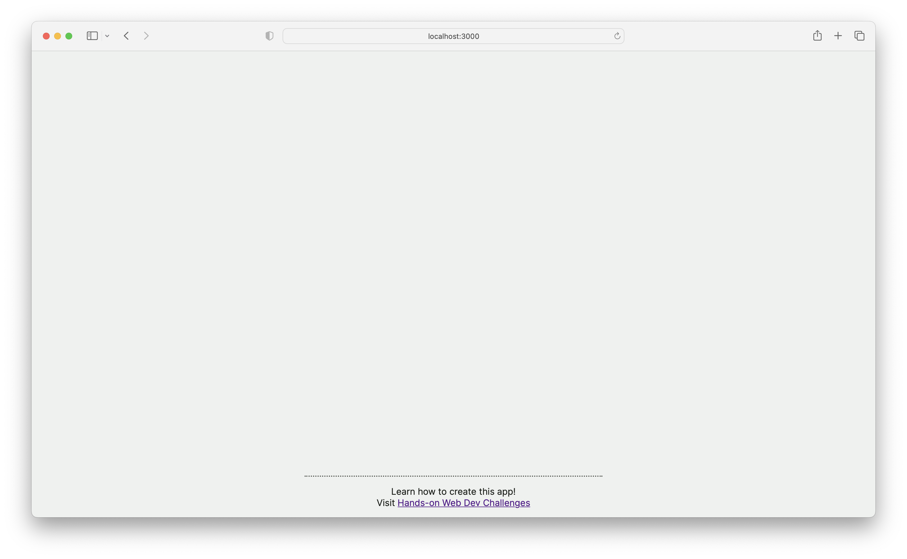

# Hands-on Web Dev React Components

This code supports the "React Components" challenge series from the [Hands-on Web Dev newsletter](https://newsletter.howd.dev).

To try the workshop, [start here](https://newsletter.howd.dev/challenges/017/)!

## Getting started

1. [Clone](https://docs.github.com/en/repositories/creating-and-managing-repositories/cloning-a-repository) or [fork](https://docs.github.com/en/pull-requests/collaborating-with-pull-requests/working-with-forks/fork-a-repo) this project.
2. Run `npm install` to install the dependencies
3. Run `npm run dev` to start the dev server
4. Navigate to `localhost:3000` from a web browser

You should see a page that looks like this:

## This project uses...

- [Next.js](https://nextjs.org/)
- [TypeScript](https://www.typescriptlang.org/)
- [CSS modules](https://github.com/css-modules/css-modules)
- Josh W. Comeau's [delightful file structure](https://www.joshwcomeau.com/react/file-structure/)
